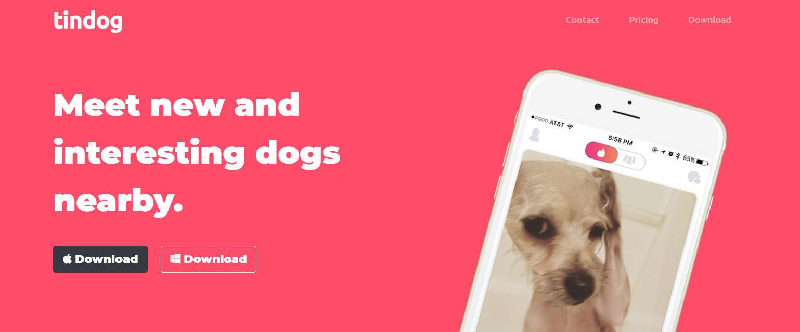

# TinDog

https://seanmonaghan.github.io/TinDog/

## Description




```

This is a landing page for a fictatious app used to display my knowledge of CSS styling.  It is a fairly simple design using HTML5 and CSS3 to emulate the popular "tinder" application.  Most of the styling is done using Bootstrap classes such as Jumbotrons, cards and carousels.  The design was planned out with a mobile-first methodology so that it looks just as good on mobile as it does on desktop.  

```
